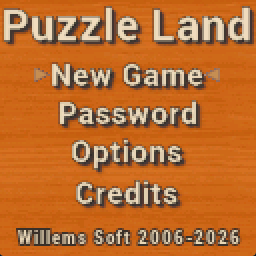
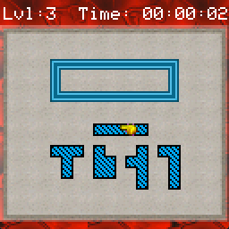

# Puzzle Land Embedded Version
   

Puzzle Land is a remake of the Game Boy game Daedalian Opus, known as Puzzle Road in Japan. The gameplay and the levels are the same, the graphics and the sounds are not. It is a tribute to a game I spent endless hours playing as a child. This version runs on the small handhelds and consoles listed below, and on Windows.

## Screenshots
The game at twice its own 128x128:

| Title screen | In game |
| --- | --- |
|  |  |

## Game Features:
- 36 Rooms
- Faithful Game Boy remake
- A password for every room, and a room selector that takes one back
- Sound can be switched on or off
- The options are saved and are back the way you left them the next time

## Playing the Game:
Every room gives you a shape and a handful of pieces. The aim is to move the pieces into place so that the shape is filled completely. Pick a piece up, move it, rotate it and flip it until it fits, and drop it where it belongs. A room that is filled hands you the password of the next one, so the game can be picked up again later from the title screen's password entry.

## Controls

| Button | Action |
| ------ | ------ |
| Dpad | Select menus, options and rooms. While playing, move the hand around, and move the piece that is held |
| A | Confirm in a menu. While playing, pick the piece under the hand up, or drop the piece that is held |
| B | Back in a menu. While playing, HOLD it and press Dpad up to rotate the piece, Dpad left to flip it vertically and Dpad right to flip it horizontally |
| A + Left + Down | Show or hide the debug info |

### Buttons
The game's buttons on every device:

| Device | D-pad | A | B |
| ------ | ----- | - | - |
| ESPboy | d-pad | ACT | ESC |
| Gamebuino META | d-pad | A | B |
| Gamebuino AKA | d-pad | A | B |
| Adafruit PyBadge | d-pad | A | B |
| Adafruit PyGamer | joystick | A | B |
| Pimoroni PicoSystem | d-pad | A | B |
| Pimoroni Explorer | A up, C down, B left, Y right | X | Z |
| Pimoroni Tufty 2350 | UP up, DOWN down, A left, C right | B | HOME |
| TinyCircuits Thumby Color | d-pad | A | B |
| Playdate | d-pad | A | B |
| Libretro | d-pad | A | B |
| Game Boy Advance | d-pad | A | B |
| Nintendo DS | d-pad | A | B |
| Nintendo 3DS | d-pad or circle pad | A | B |
| Nintendo 64 | d-pad | A | B |
| PlayStation | d-pad | Cross | Circle |
| PlayStation Portable | d-pad or the analog stick | Cross | Circle |
| PlayStation Vita | d-pad or the left stick | Cross | Circle |
| Windows | arrow keys | X | C |
| MS-DOS | arrow keys | X | C |
| Browser | arrow keys | X | C |

On the Tufty 2350 a tap of HOME is B when it is let go.

On the Gamebuino META holding HOME for a second goes back to its loader.

## Devices
Every [release](https://github.com/joyrider3774/puzzleland_embedded/releases) has a build for every device. `releases/` is where a build of your own puts them, it is not part of the repository:

| Device | File | How to install |
| ------ | ---- | -------------- |
| [ESPboy](https://www.espboy.com/) | ESPboy_Puzzleland.bin | flash it, the board is a LOLIN(WEMOS) D1 mini |
| [Gamebuino META](https://gamebuino.com/gamebuino-meta) | GamebuinoMeta_Puzzleland.zip | unzip it onto the SD card, it holds a Puzzleland_embedded folder with the game, its save and the loader's images, the .hex in it is for flashing the game directly |
| [Gamebuino AKA](https://gamebuino.com/) | Aka_Puzzleland.bin | put it on the card the AKA's loader reads, its save goes into a folder named after the game on the card |
| [Adafruit PyBadge](https://www.adafruit.com/product/4200) | PyBadge_Puzzleland.uf2 | double press reset and copy it onto the drive that appears |
| [Adafruit PyGamer](https://www.adafruit.com/product/4242) | PyGamer_Puzzleland.uf2 | same as the PyBadge |
| [Pimoroni PicoSystem](https://shop.pimoroni.com/products/picosystem) | PicoSystem_Puzzleland.uf2 | hold X while switching on and copy it onto the drive that appears |
| [Pimoroni Explorer](https://shop.pimoroni.com/products/explorer?variant=42092697845843) | Explorer_Puzzleland.uf2 | hold BOOT while pressing RESET and copy it onto the drive that appears |
| [Pimoroni Tufty 2350](https://shop.pimoroni.com/products/tufty-2350?variant=55811986227579) | Tufty_Puzzleland.uf2 | hold HOME while pressing RESET and copy it onto the drive that appears |
| [TinyCircuits Thumby Color](https://tinycircuits.com/products/thumby-color) | ThumbyColor_Puzzleland.uf2 | put it into bootloader mode and copy it onto the RPI-RP2 drive that appears |
| [Playdate](https://play.date/) | Playdate_Puzzleland.pdx.zip | unzip it and sideload Puzzleland.pdx, the same pdx runs in the Playdate simulator |
| [Libretro / RetroArch](https://www.retroarch.com/) | Libretro_Puzzleland.zip | copy puzzleland_libretro.dll into RetroArch's cores folder and puzzleland_libretro.info into its info folder, then Load Core and Start Core |
| [Game Boy Advance](https://en.wikipedia.org/wiki/Game_Boy_Advance) | GBA_Puzzleland.gba | put it on a flash cart or open it in an emulator, the options are saved in the cartridge's SRAM |
| [Nintendo DS](https://en.wikipedia.org/wiki/Nintendo_DS) | NDS_Puzzleland.nds | put it on a flash card or open it in an emulator, the options are saved next to it in Puzzleland.sav |
| [Nintendo 3DS](https://en.wikipedia.org/wiki/Nintendo_3DS) | 3DS_Puzzleland.3dsx | copy it into /3ds/ on the SD card and start it from the Homebrew Launcher, or open it in an emulator, the options are saved in sdmc:/3ds/Puzzleland_v1.0/ |
| [Nintendo 64](https://en.wikipedia.org/wiki/Nintendo_64) | N64_Puzzleland.z64 | put it on a flash cart or open it in an emulator, the options are saved in the cartridge EEPROM |
| [PlayStation](https://en.wikipedia.org/wiki/PlayStation_(console)) | PSX_Puzzleland.exe | open it in an emulator or send it to a console that runs unsigned code, nothing is saved yet |
| [PlayStation Portable](https://en.wikipedia.org/wiki/PlayStation_Portable) | PSP_Puzzleland.PBP | rename it to EBOOT.PBP and put it in ms0:/PSP/GAME/Puzzleland/ on the memory stick, or open it in PPSSPP |
| [PlayStation Vita](https://en.wikipedia.org/wiki/PlayStation_Vita) | Vita_Puzzleland.vpk | install it with VitaShell on a Vita with homebrew enabled, or open it in Vita3K |
| [CHGame](https://github.com/bateske/CH32SerialBoot) | `CHGame_Puzzleland_1.bin` … (3 of them) | flash it over USB with the `chgame-upload` that comes with the board package: `chgame-upload -port COM6 flash CHGame_Puzzleland_1.bin -run`. There is a binary per part, twelve of the thirty six rooms each: the 50944 bytes of flash do not hold the game and all of its levels at once. |
| Windows | Windows_Puzzleland.exe | runs on its own, the options are saved next to it in Puzzleland.sav |
| MS-DOS | DOS_Puzzleland.zip | unzip PUZZLELA.EXE onto a DOS machine or into DOSBox and run it, the options are saved next to it in PUZZLELA.SAV |
| MS-DOS, not dithered | DOS_Puzzleland_ND.zip | the same program with `DITHERING` 0, unzip PUZZL_ND.EXE and run it the same way. On a 256 colour screen a shade the palette has no colour for is the nearer one it does have, instead of a pattern of the two |
| Browser | Web_Puzzleland.zip | upload it to an itch.io HTML project, or unzip it and open index.html from a web server, the options are saved in the browser |

The Tufty 2350 has no speaker, the game is silent there. Holding RESET until the rear LEDs are dark puts it to sleep, a front button wakes it up again, with UP and DOWN held as well it goes into shipping mode instead.

The Thumby Color's display is 128x128, the game's own size, so it is shown 1:1 over the whole screen. That build has not been tried on the device itself yet.

The Playdate draws into a 1 bpp buffer, so it shows the black & white skin, scaled up in the middle of its display.

The Game Boy Advance shows the game scaled to 160x160 in the middle of its screen, with black bars at the sides.

On the Nintendo DS the game is scaled to 192x192 in the middle of the top screen, with black bars at the sides, and the bottom screen stays dark. What the game saves goes into Puzzleland.sav on the card it was started from, so a card that libfat can not write to (or an emulator without one) plays the game but forgets it afterwards. Its tones are square waves played as a sample: the DS's own tone channels count their frequency in a 16 bit timer and can not go below about 256 Hz.

On the Nintendo 3DS the game is scaled to 240x240 in the middle of the top screen, with black bars at the sides, and the bottom screen stays dark. What the game saves goes into a folder on the card named after the game and its version. Its tones play through the console's DSP when the DSP firmware has been dumped to the SD card (sdmc:/3ds/dspfirm.cdc), and through CSND when it has not: on hardware either one plays, in an emulator only the DSP one does.

On MS-DOS the game runs in VGA mode X, 320x240 in 256 colours, blown up to 240x240 in the middle of the screen with black bars at the sides. That mode rather than the usual 320x200 one because its pixels are square, where 320x200 is stretched over the same screen and would show the game a fifth too tall. The 256 colours are set to the RGB332 cube, which is exactly what the game's 8 bpp screen buffer holds, so a frame reaches the card without a colour being worked out. Its tones are a square wave on the PC speaker, and Escape quits. DOS takes eight characters and three, so the program is PUZZLELA.EXE and its save PUZZLELA.SAV. The program is 32 bit and carries the CWSDPMI host inside it, so it needs nothing beside it on the disk.

In a browser the game is drawn into a canvas of its own 128x128 pixels, which the page stretches to whatever room it is given while keeping it square and keeping the pixels sharp. What the game saves is kept in the browser's localStorage under the game's name, so a private window plays it but forgets it afterwards. The zip holds index.html, index.js and index.wasm and is what an itch.io HTML project takes as it is.

On the Nintendo 64 the game is drawn into memory in the colours the RDP takes and the RDP shows it scaled to 240x240 in the middle of its 320x240 screen, with black bars at the sides. Its tones are a square wave written into the buffers the sound hardware plays from. What the game saves goes into the cartridge EEPROM, which the ROM says it has, so a cartridge or an emulator without one plays the game but forgets it afterwards.

On the PlayStation the game is drawn into memory in the colours the GPU takes, handed to it as a texture and shown scaled to 240x240 in the middle of its 320x240 screen, with black bars at the sides. Its tones are a square wave the SPU plays from a single looping block. The memory card is not written yet, so what the game saves is gone when the console is switched off.

On the PlayStation Portable the game is doubled to 256x256 in the middle of the display, and what it saves goes next to the EBOOT.PBP in Puzzleland.sav.

On the PlayStation Vita the game is blown up four times to 512x512 in the middle of the display, and what it saves goes into ux0:data/Puzzleland/Puzzleland.sav.

## Building
`python tools/build_releases.py` builds a release for every device  
`python tools/convert_skins.py` turns the images in `assets/skins` into the headers the game includes  
`python tools/convert_levels.py` turns the level files in `assets/levelpacks` into `levels.h`  
`python tools/fix_transparency.py` puts the transparent pixels of the skin images back to exactly magenta

### Where the tools are
The script looks for everything in the place it is installed in here. A tool somewhere else is passed on the command line, or set as the environment variable in the last column and left off the command line:

| Option | What it points at | Default, or environment variable |
| ------ | ----------------- | -------------------------------- |
| `--arduino-cli PATH` | arduino-cli, which builds the Arduino devices | `ARDUINO_CLI` |
| `--arduino DIR` | the Arduino IDE 1.8 folder, used when there is no arduino-cli | `C:/arduino`, `ARDUINO_DIR` |
| `--arduino2 DIR` | the Arduino IDE 2 folder, whose own arduino-cli builds the CHGame | `C:/arduino2`, `ARDUINO2_DIR` |
| `--lovyangfx DIR` | LovyanGFX for the Windows build, when it is not the one in the sketchbook | `LOVYANGFX_DIR` |
| `--msys2 DIR` | MSYS2's mingw64 bin folder, for cmake and ninja | `C:/msys64/mingw64/bin`, `MSYS2_BIN` |
| `--playdate-sdk DIR` | the Playdate SDK | `C:/playdate/PlaydateSDK`, `PLAYDATE_SDK_PATH` |
| `--playdate-arm DIR` | the bin folder of the ARM gcc the Playdate needs | `PLAYDATE_ARM_BIN` |
| `--libretro-common DIR` | libretro-common | `C:/github/libretro-common`, `LIBRETRO_COMMON_DIR` |
| `--devkitpro DIR` | devkitARM with libgba, libnds, calico, libctru and tools | `C:/devkitarm`, `DEVKITPRO` |
| `--psn00bsdk DIR` | PSn00bSDK | `C:/psn00bsdk`, `PSN00BSDK_PREFIX` |
| `--n64 DIR` | the mips64-elf toolchain with libdragon | `C:/n64_dev`, `N64_INST` |
| `--emsdk DIR` | the Emscripten SDK | `C:/github/emsdk`, `EMSDK` |
| `--dosdev DIR` | DJGPP with CWSDPMI | `C:/dos_dev`, `DOSDEV` |
| `--pspdev DIR` | the pspdev toolchain | `C:/psp_dev`, `PSPDEV_DIR` |
| `--vitasdk DIR` | VitaSDK | `C:/psvita_dev`, `VITASDK` |
| `--idf DIR` | ESP-IDF, for the Gamebuino AKA | `C:/github/esp-idf`, `IDF_PATH` |
| `--aka-lib DIR` | the Gamebuino AKA library | `C:/github/Gamebuino_AKA_lib`, `AKA_LIB_DIR` |
| `--sdl2-mingw DIR` | SDL2's mingw package, its x86_64-w64-mingw32 folder | `SDL2_MINGW` |

Only the devices being built need their tool, so one missing toolchain does not stop the rest:

```
python tools/build_releases.py --only N64 DOS --n64 D:/n64_dev --dosdev D:/dos_dev
python tools/build_releases.py --list          shows what would be built
python tools/build_releases.py --only Web      one device only
```

### Build settings
Every device is built with its own settings. These change them for all of the devices at once, and `--list` shows what the defines would be without building anything. They are the same defines the device headers and the `platforms/*/CMakeLists.txt` files take, so a single device can be built with `-D<name>=<value>` from cmake instead:

| Option | What it sets | Values |
| ------ | ------------ | ------ |
| `--forceskin N` | `FORCESKIN`, the skin built in | `-1`, `0` (default) or `1` (black & white) |
| `--forcescreenbuffer N` | `SCREENBUFFER`, where drawing goes | `0`, `1`, `8` or `16` bits per pixel |
| `--forcescale N` | `SCALESCREEN`, how the game fills the display | `1` blown up, `0` 1:1 in the middle |
| `--forcewindowscale N` | `WINDOW_SCALE`, how big the Windows window opens | `1` to `8` times the game's size |
| `--forcedithering N` | `DITHERING`, whether an 8 or 1 bpp buffer spreads its colours | `1` spread, `0` the nearest colour |
| `--forcedebug` | `FORCEDEBUG 1`, the debug header is always shown | no value, on when it is given |

The game has no skin option of its own, so exactly one skin is built in and `-1` picks it: the default one, or the black and white one when the buffer is 1 bpp, see `FORCESKIN` in `defines.h`.

Not every device takes every buffer mode, `platforms/<device>/CMakeLists.txt` says which, and one it does not take stops that build with a message. A 1 bpp buffer can only show the skin that is black and white, so it forces that skin whatever `--forceskin` says.

```
python tools/build_releases.py --forceskin 1                only the black & white skin, on every device
python tools/build_releases.py --only Windows --forcescreenbuffer 1
python tools/build_releases.py --list --forcedebug          what the defines would be
```

### Board packages and libraries
The Arduino devices are built with arduino-cli 1.5.1 and the versions below. They are the ones every release is built with, `.github/workflows/build-releases.yml` pins them:

| Device | Board package | Libraries |
| ------ | ------------- | --------- |
| ESPboy | esp8266:esp8266 3.1.2 | LovyanGFX 1.1.9, TFT_eSPI 2.4.72 |
| Gamebuino META | gamebuino:samd 1.2.2 | Gamebuino META 1.3.3 |
| Adafruit PyBadge, PyGamer | adafruit:samd 1.7.16 | Adafruit GFX Library 1.12.6, Adafruit ST7735 and ST7789 Library 1.5.15, Adafruit BusIO 1.17.4, Adafruit NeoPixel 1.15.5, Adafruit SPIFlash 5.1.1 |
| PicoSystem, Explorer, Tufty 2350, Thumby Color | rp2040:rp2040 5.5.0 | none, everything they use comes with the core |
| CHGame | CHGame:ch32v 0.2.4 | none, the core brings its own riscv-none-embed-gcc |

The ESPboy draws through LovyanGFX and only includes TFT_eSPI's header, so the exact TFT_eSPI does not matter much.  
The Gamebuino's core needs Arduino's own arduino:samd 1.8.14 beside it for sam.h, without it the build stops at "sam.h: No such file or directory".  
The CHGame's board package is only published for the Arduino IDE 2, so that device is built with the
arduino-cli that IDE 2 ships (`--arduino2`) while the rest use the IDE 1.8 folder, in the same run.
Its CH32X035 has 50944 bytes of flash for the game and 20464 bytes of RAM, so it builds the black &
white skin alone and nothing else: every picture is packed one bit a pixel instead of as RGB565,
which is what makes the game fit at all. See `FORCESKIN` and `ONEBITIMAGES` in `defines.h` and
`source/*/PlatformCHGame.h`.

The Windows build draws through the same LovyanGFX 1.1.9, see `platforms/windows/CMakeLists.txt`.

### Toolchains
The Playdate build also needs the Playdate SDK, see `platforms/playdate/CMakeLists.txt`  
The libretro core needs libretro-common, see `platforms/libretro/CMakeLists.txt`  
The Gamebuino AKA build needs ESP-IDF and the AKA library, see `platforms/aka/CMakeLists.txt`  
The Game Boy Advance build needs devkitARM and libgba, see `platforms/gba/CMakeLists.txt`  
The Nintendo DS build needs devkitARM, libnds and calico, see `platforms/nds/CMakeLists.txt`  
The Nintendo 3DS build needs devkitARM and libctru, see `platforms/3ds/CMakeLists.txt`  
The PlayStation build needs PSn00bSDK, see `platforms/psx/CMakeLists.txt`  
The Nintendo 64 build needs the mips64-elf toolchain and libdragon, see `platforms/n64/CMakeLists.txt`  
The PSP build needs the pspdev toolchain, see `platforms/psp/CMakeLists.txt` (pspdev has no Windows build, so on Windows it is built from WSL)  
The Vita build needs VitaSDK, see `platforms/vita/CMakeLists.txt`  
The browser build needs Emscripten, see `platforms/web/CMakeLists.txt`  
The MS-DOS build needs DJGPP, see `platforms/dos/CMakeLists.txt`

## Credits
Puzzle Land is a remake of Daedalian Opus for the Game Boy by Vic Tokai Inc., 1990

Yann R. Fernandez aka Ryf made the main character, the fairy, the shadow and the clouds

The rest of the graphics are made by me, Willems Davy aka joyrider3774, using gimp
